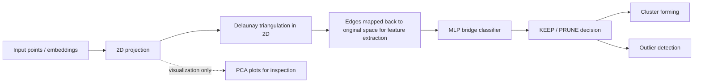

# Deltric MLP Bridge Report

_Prepared from the synthetic-data and bridge-classifier work completed in this branch._

## Pipeline Overview

The important detail is that triangulation is built in the projected 2D space, while the edge features are computed from the original space. PCA is used for plotting and inspection only. For the bridge model we keep the geometry pipeline consistent across scripts so that training and inspection do not drift apart.

## Executive Summary

Deltric is being developed as a robust clustering system with outlier detection. The core idea is to prune a candidate triangulation graph before cluster formation. If the graph keeps true intra-cluster edges and removes bridge edges between clusters, downstream clustering becomes much more stable across different shapes, densities, and dimensions.

The pruning rule is not a single simple threshold. In practice, the signal depends on local density gradients, edge-length distributions, bridge geometry, and the global scale of the dataset. That combination is hard to encode as a hand-written rule set, so we generate synthetic supervision and train a compact MLP to learn the prune / keep decision.

This is not intended to replace clustering. It is intended to make the graph cleaner before clustering, while also helping isolate outliers more consistently.

## Why Synthetic Training

We do not assume that one static geometric heuristic will generalize to all datasets. Real embeddings can be:

- dense or sparse
- well separated or partially overlapping
- blob-like or manifold-like
- low-dimensional or high-dimensional
- smooth, spiky, or strongly anisotropic

That variability is especially common in NLP embeddings, where different tasks, layers, and domains produce very different spatial structures. The synthetic datasets are used to cover these geometric regimes in a controlled way so the pruning model learns a broad geometric prior instead of overfitting to a single benchmark family.

The working assumption is:

1. Inter-cluster bridge edges tend to sit in a different local neighborhood pattern than true intra-cluster edges.
2. Those patterns are visible in the edge's 1-hop and 2-hop edge-length neighborhoods and in the global edge-length distribution.
3. A small MLP can approximate that decision surface better than a brittle hand-written rule.

## Synthetic Dataset Design

We iterated heavily on the synthetic data before training because the quality of the pruning signal depends on the geometry of the training corpus.

### Phase 1 datasets

The phase-1 corpus now covers:

- 500, 1000, and 2000 points
- 2D, 10D, and 100D
- three main cluster styles:
  - dense and clearly separated blobs
  - sparse and partially overlapping blobs
  - manifold-like or mixed-density blobs
- direct thin-moon variants in 10D and 100D

The current phase-1 set contains:

- 18 base datasets in `phase1_manifest.json`
- 16 direct high-dimensional variants in `phase1_direct_manifest.json`

That gives 34 phase-1 datasets in total.

### V3 datasets

The v3 tuning corpus adds more difficult examples, including:

- overlap blobs in 2D, 10D, and 100D
- varying-density blobs
- moons
- curved manifolds
- close manifolds / S-curves

We also added extra overlap variants at 2000 points so the training set has more distinct edges and fewer repeated samples.

### Cleanup and label correction

Before inspection and training, the synthetic point labels are cleaned so that the graph label signal is not dominated by trivial noise.

The cleanup logic evolved as follows:

- kNN repainting: if a point is surrounded by neighbors of a different class, it is reassigned to the surrounding blob
- anomaly handling: true outliers are marked separately, but only when the dataset supports that interpretation
- moons: no anomaly detection, because moons should remain two clean manifold classes
- v3 overlap blobs: label `3` is not automatically treated as an anomaly, because in those datasets it is often just a normal cluster label

This matters because the pruning label must reflect geometry, not a mislabeled point artifact.

## Training Data For The MLP

The pruning model is trained on candidate Delaunay edges labeled as:

- `KEEP` if both endpoints belong to the same cleaned cluster
- `PRUNE` if the endpoints belong to different cleaned clusters
- `PRUNE` if both endpoints are anomalies, when the dataset truly contains anomalies

The training set is balanced per dataset as much as possible, with extra focus on:

- bridge edges between clusters
- medium-length edges near the local median
- sparse-overlap regions where the decision is ambiguous

When prune edges are scarce, the sampler falls back to other regions, but it still prefers the bridge-like sector because that is where the learning signal lives.

## Feature Design

The current bridge model uses original-space features only. We deliberately avoided relying on UMAP-space features for the classifier itself because the projected geometry can become too distorted.

The latest feature vector contains:

- 1-hop edge-length histogram around the target edge
  - 4 bins in the range `(0, L]`
  - 1 overflow bin for edges longer than `L`
- 2-hop edge-length histogram around the target edge
  - 6 bins in the range `(0, L]`
  - 1 overflow bin for edges longer than `L`
- global edge-length statistics
  - median
  - IQR
  - p05
  - p95
  - mean
  - std
  - skew
  - kurtosis
- target edge length normalized by the dataset median edge length
- original dimension, encoded as `log1p(dim)`

In total, the current model consumes 22 features.

This feature set evolved from a smaller bridge descriptor. The additional global statistics were added because we found that the model needed more information about whether the dataset-wide edge-length distribution was narrow, spiky, or broad. That became important for sparse overlap and mixed-density datasets.

## Model Shape

The classifier itself is intentionally small:

- a compact feed-forward MLP
- trained on the balanced `KEEP` / `PRUNE` edge dataset
- used as a bridge detector, not as a full clustering system

The model is only one component of the full pipeline. Its job is to decide whether a candidate edge is likely to preserve cluster structure or bridge two different structures.

## Implementation Notes

Several implementation details were important to keep the system stable:

- triangulation is done in UMAP 2D for the bridge pipeline
- PCA is used for plotting only
- all plotting scripts now share the same UMAP settings
- dataset discovery is manifest-driven so inspection and training use the same curated files
- outliers are shown in black only when they are actually inferred as anomalies
- the 6-cluster v3 datasets are no longer misread as having a black anomaly cluster just because one cluster label happened to be `3`

The relevant scripts are now aligned around the same setup:

- `benchmark_clustering_tuning/run_plot_stages.sh`
- `benchmark_clustering_tuning/run_plot_mlp_stages.sh`
- `benchmark_clustering_tuning/run_plot_mlp_training_edges.sh`

## Preliminary Results

The work is not a final benchmark result, but the qualitative signal is strong.

Observed improvements after the dataset and labeling cleanup:

- moons now render as two moons instead of collapsing into a ring-like structure
- sparse-overlap datasets show more meaningful bridge edges
- the 10D sparse-overlap corpus is less over-collapsed after increasing separation
- the 100D overlap blobs now remain useful instead of collapsing into ambiguous clutter
- outlier coloring no longer pollutes normal clusters in the v3 6-cluster datasets

Earlier MLP runs on the curated synthetic corpus produced very strong synthetic F1, but the more important outcome was that the visual inspection of the selected bridge edges started to match the intended geometry much better after the dataset refinements.

That is the main signal we care about at this stage:

- the model is learning bridge structure
- the training corpus is covering difficult geometric regimes
- the pruning decision is becoming less brittle than a manual heuristic would be

## Why This Is A Reasonable Plan

This approach is reasonable because it turns pruning into a supervised geometric problem.

Instead of asking a human to encode all density-gradient and bridge rules by hand, we:

1. generate synthetic data that spans the relevant geometry
2. label candidate edges from cleaned clusters and anomalies
3. train a compact MLP on local and global edge context
4. apply the classifier to real clustering benchmarks

That gives us a model that is:

- data-driven
- explainable at the feature level
- cheap to evaluate
- flexible across shapes and densities

For NLP embeddings in particular, that flexibility matters because different corpora often produce different manifold shapes, densities, and local overlap patterns.

## Current Status

The current branch has:

- unified UMAP-based triangulation for the bridge pipeline
- phase-1 synthetic data regenerated
- v3 overlap data regenerated
- anomaly handling fixed for moons and v3 cluster labels
- black outlier rendering in the training-edge inspection plots
- manifest-driven dataset discovery so training and inspection use the same curated files

The MLP itself was not retrained after the latest dataset refresh in this round. The next step is to retrain on the updated corpus and re-check the real benchmarks.

## Next Step

Retrain the MLP on the refreshed synthetic corpus, then run the real benchmark plots again to confirm that the bridge decisions stay stable on the intended datasets.
